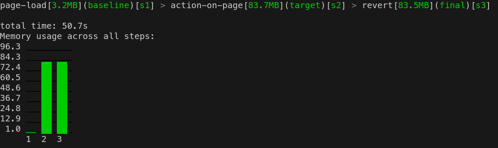
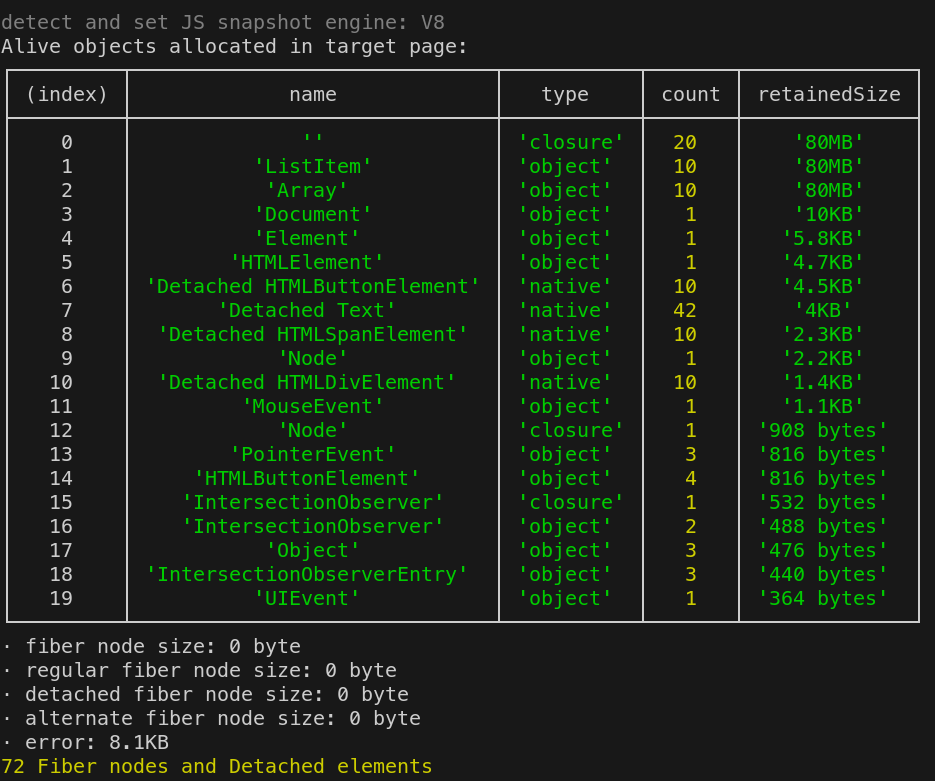
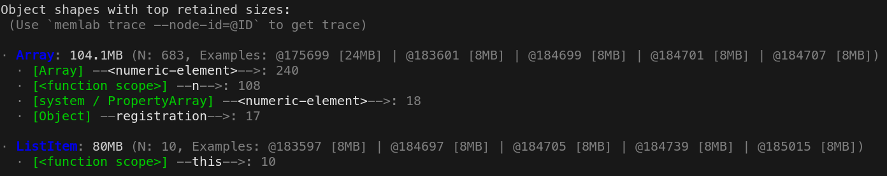
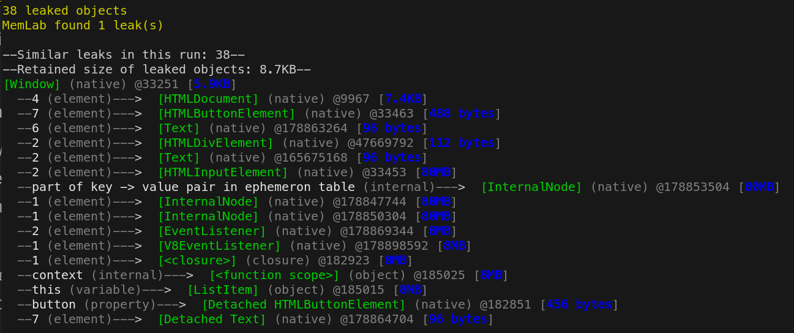
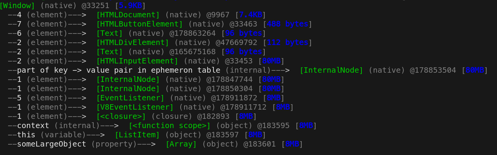
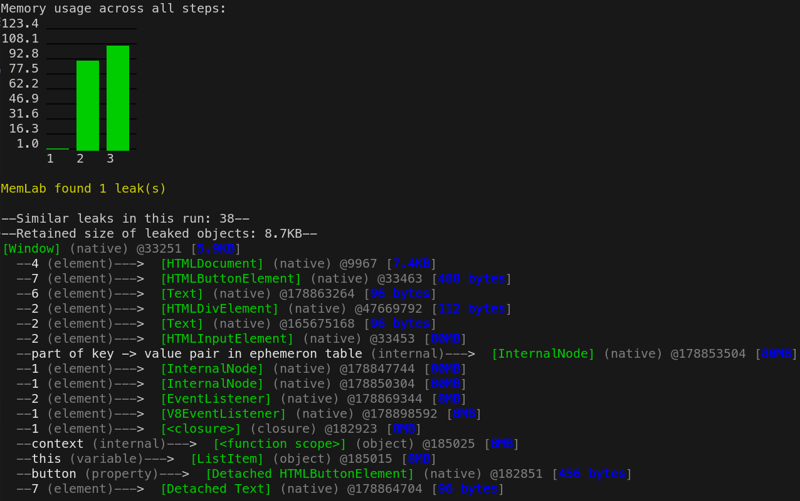
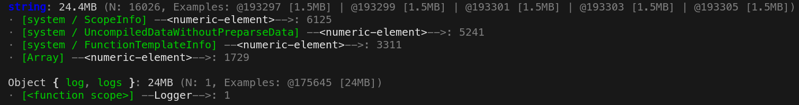
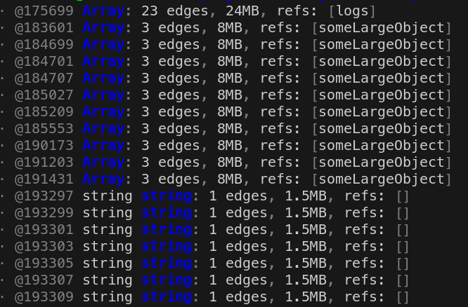
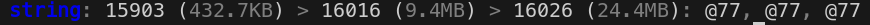
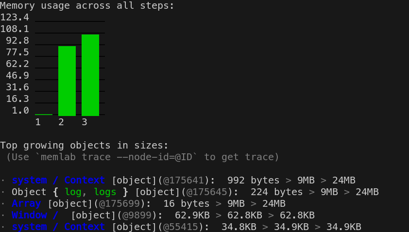

# Memlab Analysis

This document should explain how to conduct memory consumption and leak analysis with the
[`memlab`](https://github.com/facebook/memlab) tool.

The described process will use scenarios in order to automatically generate comparable
memory heap snapshots based on defined user flows.

## Setup Scenario

Read more about how to set up a scenario [here](scenario.md).

## Generate Heap Snapshots

Having the scenario implemented, we can let memlab execute and analyse it.

```bash
memlab run --scenario ./scenario.js
```

By default, memlab runs in `headless` mode. If you want to visually see what memlab is doing
with your application, you can pass the `--headful` argument.

Memlab will now perform each step defined in the scenario.
After each step a `GC` run will be trigger and a memory heap snapshot will be generated.
When the process is finished, memlab analyses the recordings and presents the outcomes in the terminal.

> screenshots & heaps are stored in /tmp/memlab/data/cur if not specified with `--work-dir`

### Overview

First you will get an overview of the memory consumption for each step of the scenario.

The following graphic showcases the overview information presented by `memlab run --scenario`.

#### Memory consumption



Each bar in the bar chart represents the amount of memory held by the application after a step was performed.
You can see that the `action` is adding `~ 80 MB` to the memory heap. The amount of memory
won't be reduced after the `back (revert)` action was performed, which indicates a memory leak.

#### Alive objects in memory

On top of the memory consumption overview, memlab provides you a table giving information
about objects being alive in the memory heap.



The table shows which objects consume how much memory.
This particular output indicates there are 20 `Closures` (anon functions) holding 10 `ListItems` which take up `80 MB` of
memory.

### Details

On top of the overview information, memlab will automatically generate two more reports
when running a scenario: `shape analysis (memlab analyse shape)` & `memory leak detection (memlab find-leaks)`.

#### Object shapes with top retained size

Besides the overview of alive objects, memlab also provides detailed information about
the shapes with the highest retained size in the current heap.



memlab basically performs the `analyze shape` command. Read more about it [here](#analyze-object-shapes).

#### Memory Leak detection

As a final step of the scenario analysis, memlab tries to automatically identify memory leaks and
present the findings.

You will see an estimated number of objects being leaked and node traces of the leaked objects.
From the trace you can derive information about the lines of code that cause the memory leak.



memlab basically performs the `find-leaks` command. Read more about it [here](#analyze-object-shapes).

## Trace a node

`memlab trace --node-id=@ID`

Whenever you identify a memory leak or want to have more detailed information about certain nodes of the heap, memlab
provides you with a tracing tool.
A trace will show you the list of retainers of the given node. Retainers are the nodes that keep the requested node
in memory.

The following example shows the trace of `memlab trace --node-id=@183601`.
We can see that the object `someLargeObject` is kept in memory by `ListItem`.



## Analyze Heap

Memlab offers a wide variety of analysis tools you can run with the cli tool.

### detect memory leaks

`memlab find-leaks`

Memlab tries to automatically point out memory leaks found in the recorded heap snapshots. If a memory leak was identified
it will automatically print the corresponding node trace. From the trace you can derive information about the
lines of code that cause the memory leak.



### Analyze object shapes

`memlab analyze shape`

`Shapes` are a grouped view on objects, as objects will be grouped by their actual `shape` (e.g. `{ logs, log }`).
For each `shape`, memlab provides information about the cumulated size as well as example nodes which indicate their
`id` and `size`.

> we can use the node id to trace single nodes with `memlab trace --node-id=@ID`




### get largest object in heap

`memlab analyze object-size`

The object-size report provides information about the largest instances of objects
stored in memory.

The following object-size report shows that the largest object stored in memory is
a single `Array` with `24 MB` in size. It is referenced by a property called `logs`.



### Analyze shapes with unbound growth

`memlab analyze unbound-shape`

The unbound-shape report will give information about `shapes` (groups of objects) that grow
over time. For each shape it will report it's aggregated size per step of the given scenario.

The following report shows that the `string shape` is growing from `432KB` > `9.4MB` > `24.4MB`.



### see which object keeps growing in size over time

`memlab analyze unbound-object`

The unbound-object report will give information about instances of `Object` that grow
over time. For suspicious instances it will report their size per step of the given scenario.

The following report shows the object `{ log, logs }` growing from `224 bytes` > `9.4MB` > `24.4MB`.
It also looks like an `Array` is growing about the same amount, most probably those objects are connected with each other.



## Further Readings

[official memlab docs](https://facebook.github.io/memlab/docs/intro)
